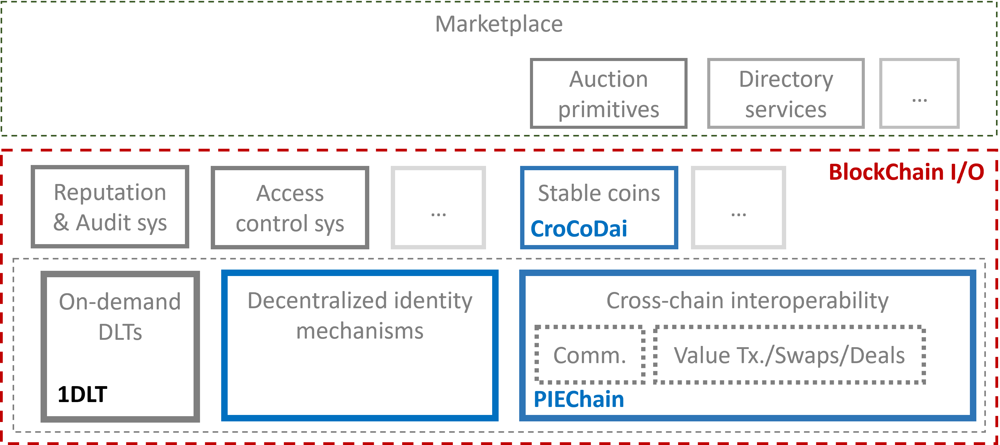

# Blockchain-I-O
In this work, we enumerate a set of additional desirable functionalities required as building blocks for versatile cross-chain commerce, and describe a modular technology stack, BlockChain I/O (see Figure 1) that achieves these desiderata.



## Entities
* The Kafka network provider, who maintains the Kafka network.
* Developers, who develops cross-chain services (CC-SVCs) using an event-
driven approach.
* End users, who deploy smart contracts and use the CC-SVCs for cross- chain operations.

## Setup

### Go
```bash
go mod init github.com/Guy1m0/Blockchain-I-O
sudo go mod tidy
```

### Kafka
Start Kafka with `docker-compose`.
```bash
cd kafka
docker-compose up -d

# to stop after experiments
docker-compose down
```

### Fabric
Install Hyperledger Fabric.
```bash
cd fabric
./install.sh
```

### Ethereum
Install go-ethereum and quorum.
```bash
cd ethereum
sudo ./install.sh
```

## Cross-chain Auction

1. Setup Docker.
Start kafka
```bash
cd kafka
./docker-compose up -d
```

Start Fabric network
```bash
cd fabric-samples/test-network
./network.sh up createChannel -ca
```

> The error "Failed to connect to gateway: Failed to apply identity option: Invalid identity format: invalid character 'A' after top-level value" is caused by the certificate generated by without adding "-ca". If it shows similar error, just restart several times until it works.

2. Run Ethereum POA.
```bash
cd ethereum/poa
./remove.sh
./init.sh
./start.sh
```

3. Run Quorum Raft.
```bash
cd ethereum/raft
./remove.sh
./init.sh
./start.sh
```

4. Deploy `fabric_asset` on `fabric`.
```bash
sudo ./network.sh deployCC -ccn asset -ccp ../../contracts/fabric_asset/chaincode -ccl go
```

5. Run `relayer` crosschain service.
```bash
cd examples/auction/relayer
sudo go build .
./relayer
```

6. Run `signer` crosschain services.

```bash
cd examples/auction/signer
go build .

# on different terminals
./signer -t -p ethereum -eth localhost:8545 -key ../../keys/key1 -id 1
./signer -p ethereum -eth localhost:8545 -key ../../keys/key2 -id 2
./signer -p quorum -eth localhost:8546 -key ../../keys/key1 -id 1
./signer -p quorum -eth localhost:8546 -key ../../keys/key2 -id 2
```

7. Run the `scenario` script.
```bash
cd examples/auction/scenario
go build .
sudo go run .
```

8. Stop running Containers and Eth private networks

Firstly, stop execution for each signers and relayer.

Then, stop each running networks
```bash
# Raft
cd ethereum/raft
./stop.sh
./remove.sh
# Poa
cd ../poa
./stop.sh
./remove.sh

```
Finally, stop running containers in Docker


```bash
cd fabric-samples/test-network
./network.sh down
cd ../..

cd kafka
docker-compose down
```


The scenario script will do the following steps.
1. Add a new asset on the fabric `asset` contract.
3. Deploy auction contracts on `ethereum` and `quorum`.
2. Create a new auction for this asset on on fabric.
3. Bid correspondingly on both `ethereum` and `quorum`.
4. End auction on `fabric` and print out the winner info and final asset owner on `fabric`.


# Note

About the error 
```bash
Failed to connect to gateway: Failed to apply identity option: Invalid identity format: invalid character 'n' after top-level value
```

It may be caused by the support of RSA, which was later removed during the development of release 2.0. Even v2.2.2 added toleration for RSA public keys in CA certificates for the SW MSP implementation, it highly recommended that using recent release like v2.5.1

It is worthy noting that v2.2.11 might be a alternative release also supports RSA key and cert.

For M1 chip user, better use Fabric no later than v2.5.0 and Fabric-CA no later than v1.5.6